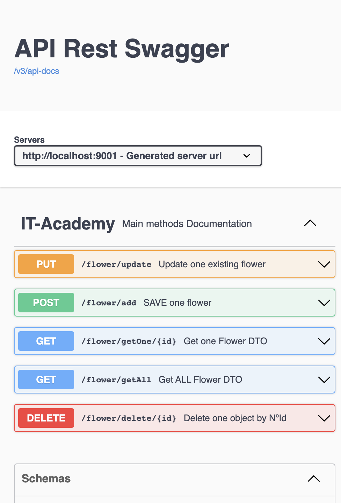
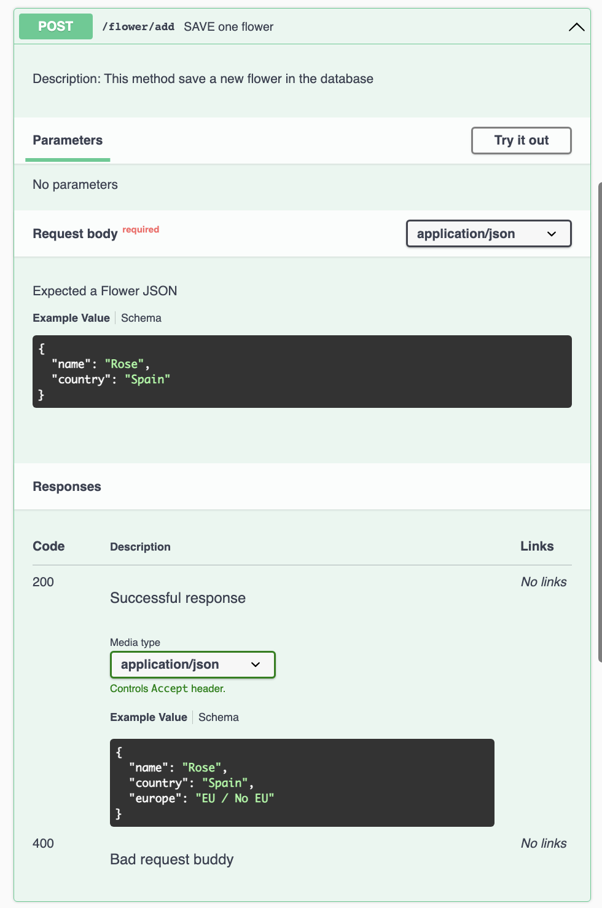
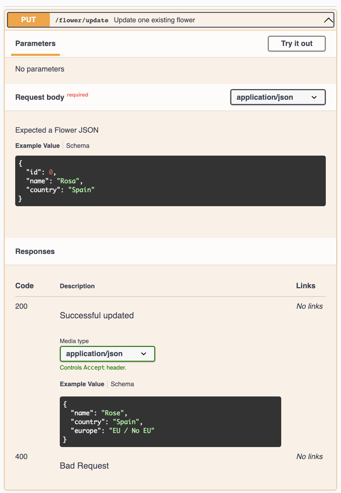
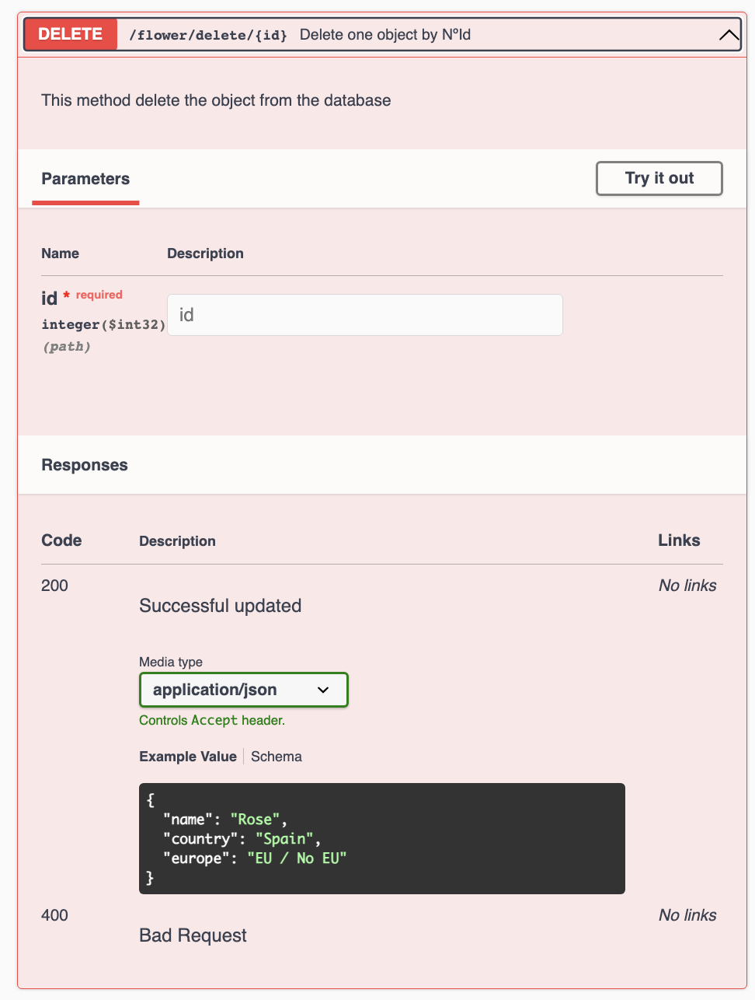
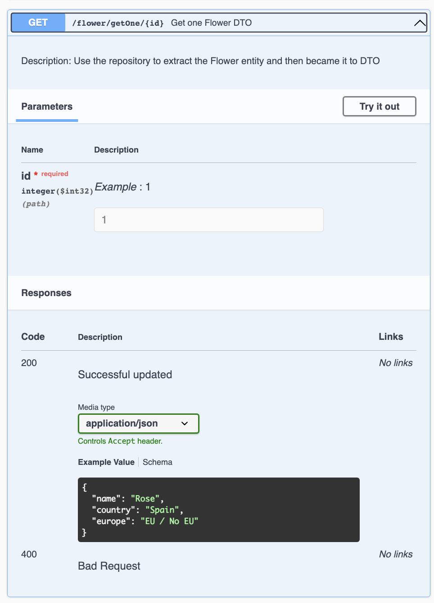

## API Rest App with SQL (SpringBoot - Swagger)

Open API - Swagger 

<table>
   <tr>
      <td>
All Methods
</td>
      <td>
Save
</td>
   </tr>
   <tr>
      <td> 
      
      </td>
      <td>
      
      </td>
   </tr>
  <tr>
      <td>
Update
</td>
      <td>
Delete
</td>
  </tr>
  <tr>
      <td> 
      
      </td>
      <td>
      
      </td>
  </tr>

  <tr>
      <td>
GetAll
</td>
      <td>
GetOne
</td>
  </tr>
  <tr>
      <td> 
      
      </td>
      <td>
      
      </td>
  </tr>

</table>

References:
- [Swagger - Extended course](https://www.youtube.com/watch?v=0vqgWQIVfMI&t=2538s)
- [Swagger - Summary course](https://www.youtube.com/watch?v=2o_3hjUPAfQ)
- [Documnetation](https://www.bezkoder.com/swagger-3-annotations/)