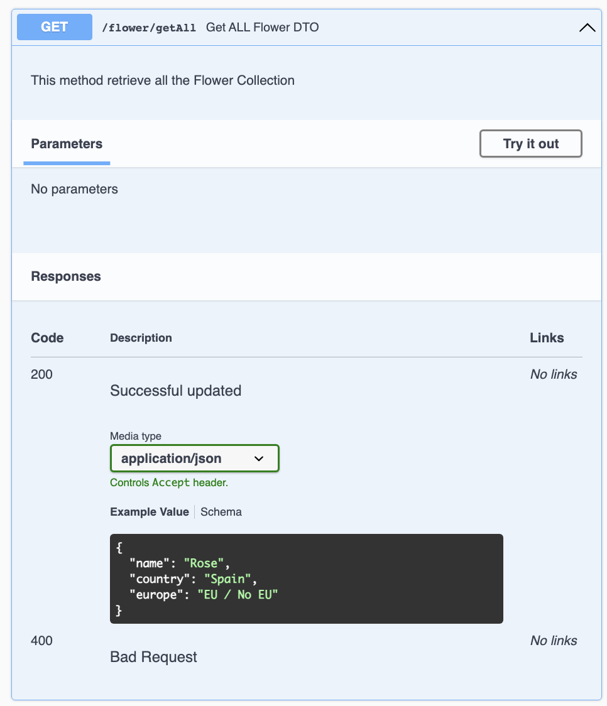

## API Rest App with SQL (SpringBoot - Swagger)

Open API - Swagger 

All methods

- Save

- GetAll
  

References:
- [Swagger - Extended course](https://www.youtube.com/watch?v=0vqgWQIVfMI&t=2538s)
- [Swagger - Summary course](https://www.youtube.com/watch?v=2o_3hjUPAfQ)
